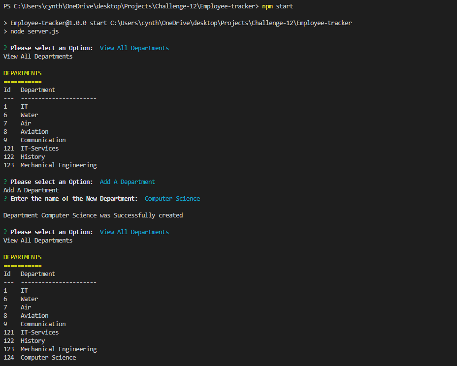
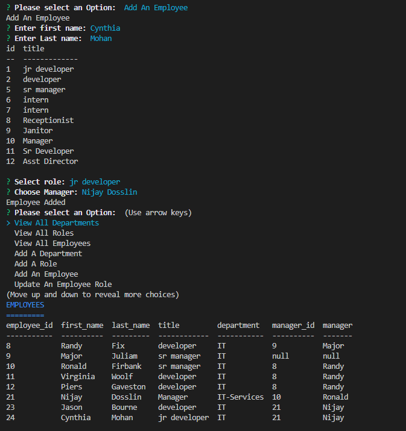
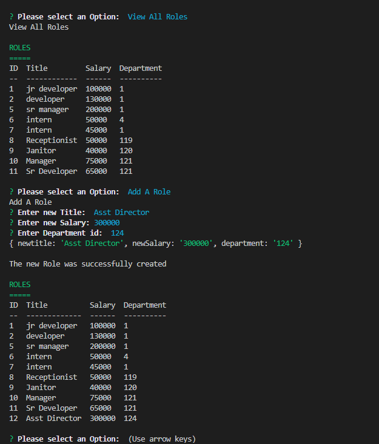
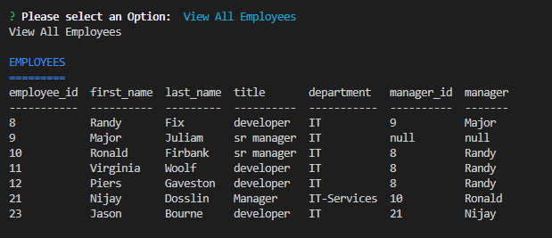
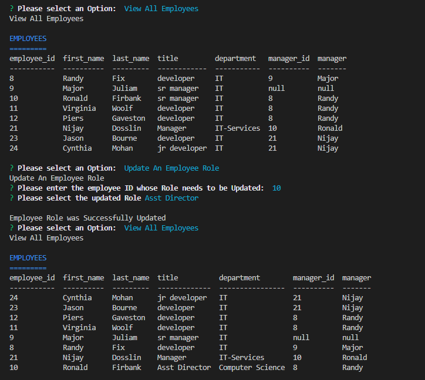

# Employee-tracker

## Description
A command-line application that accepts user input enabling a user (business owner) to be able to view and manage the departments, roles, and employees in the company
so that they can organize and plan the business.

## Table of Contents 

* [Installation](#installation)
* [Usage](#usage)
* [License](#license)
* [Contributing](#contributing)
* [Tests](#tests)
* [Questions](#questions)

## Installation

* Run `npm init -y`

* Install inquirer mysql2 and console.table using `npm i inquirer mysql2 console.table`

## Usage

Walk through video: 
https://drive.google.com/file/d/1w2NrxDArYlXoXfIzl7NJMEnxrR6v0Kcr/view
 

  

  

  

  

  

## Questions
View my Github Profile at [CynthiaMohan](http://github.com/CynthiaMohan)
 
Reach me with more questions <cynthiamohan1@gmail.com>

